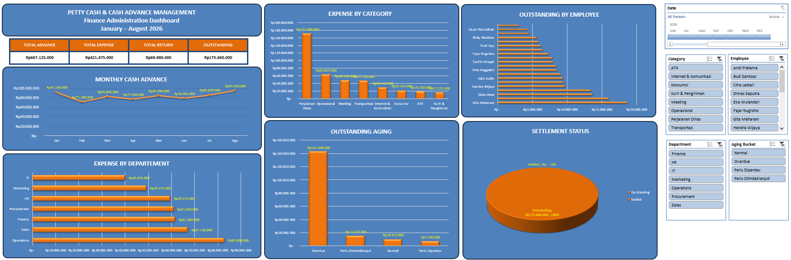

# Finance Admin – Petty Cash & Cash Advance Management

## 📌 Project Overview

An Excel-based Finance Administration project designed to monitor employee petty cash and cash advance transactions, track outstanding balances, and support financial document reconciliation.

This project simulates a real-world Finance Admin workflow involving transaction recording, data cleaning, reconciliation, monitoring, and reporting.

## 🎯 Objectives

* Monitor petty cash and cash advance transactions
* Identify outstanding employee balances
* Reconcile advance, expense, return, and outstanding amounts
* Analyze expenses by department and category
* Monitor settlement status
* Create an interactive finance dashboard for management reporting

## 📊 Key Features

### Data Processing

* Data cleaning
* Duplicate checking
* Sorting & filtering
* Data validation
* Structured Excel Table

### Financial Reconciliation

The project applies the following reconciliation logic:

**Advance = Expense + Return + Outstanding**

Transactions are classified as:

* **Settled** → Outstanding = 0
* **Outstanding** → Outstanding > 0

### Analysis

The workbook includes PivotTables for:

* KPI Summary
* Outstanding by Employee
* Expense by Category
* Expense by Department
* Monthly Cash Advance
* Outstanding Aging
* Settlement Status

### Dashboard

The interactive dashboard provides:

* Total Advance
* Total Expense
* Total Return
* Total Outstanding
* Monthly Cash Advance Trend
* Expense by Department
* Expense by Category
* Top Outstanding Employees
* Outstanding Aging
* Settlement Status

Interactive filters are provided through Excel Slicers.

## 🛠️ Tools & Skills

* Microsoft Excel 2019
* PivotTable
* PivotChart
* Slicer
* IF
* SUMIFS
* Data Cleaning
* Data Reconciliation
* Financial Administration
* Dashboard Reporting

## 📁 Dataset

The dataset contains simulated Finance Administration transactions covering:

* Employee transactions
* Cash Advance
* Petty Cash
* Expense
* Return
* Outstanding balances
* Settlement status

All data in this project is simulated and does not contain real company or employee information.

## 📷 Dashboard Preview

## 💼 Relevant Finance Admin Skills

This project demonstrates practical skills relevant to Finance Administration roles, particularly:

* Petty Cash Monitoring
* Cash Advance Checking
* Transaction Reconciliation
* Outstanding Monitoring
* Financial Document Administration
* Data Analysis
* Management Reporting

## 👤 Author

Triambodo
